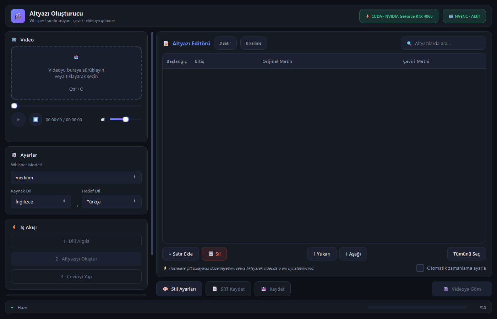

# Dipyazı

Whisper tabanlı, PyQt6 ile geliştirilmiş masaüstü altyazı oluşturma ve düzenleme uygulaması.


## Ekran Görüntüleri

<div align="center">
  
</div>

> Uygulama karanlık tema ile tasarlanmış modern bir arayüze sahiptir.

## Özellikler

- **Ses Tanıma**: OpenAI Whisper ile yüksek kaliteli transkripsiyon
- **Çeviri**: Otomatik çoklu dil çevirisi
- **Video Oynatıcı**: Dahili video oynatıcı ile altyazı zamanlama kontrolü
- **Altyazı Editörü**: Kolay düzenleme, satır ekleme/silme, zamanlama ayarlama
- **Stil Önizleme**: Gerçek video karesi üzerinde altyazı stilinin anlık önizlemesi
- **Video Gömme**: FFmpeg ile altyazıları doğrudan videoya gömme
- **Sürükle-Bırak**: Video dosyalarını doğrudan uygulamaya sürükleme desteği
- **Proje Kaydı**: Otomatik proje kaydetme ve geri yükleme
- **Mevcut Altyazı Yükleme**: Oluşturulmuş SRT/ASS dosyalarını içe aktarma

## Kurulum

### Ön Koşullar

- Python 3.10 veya üzeri
- [FFmpeg](https://ffmpeg.org/download.html) (PATH'e eklenmeli)
- CUDA uyumlu GPU (isteğe bağlı, hızlandırma için)

### Kurulum Adımları

```bash
# Depoyu klonlayın
git clone https://github.com/Cymeria/dipyazi.git
cd dipyazi

# Sanal ortam oluşturun (önerilen)
python -m venv venv
venv\Scripts\activate  # Windows
# source venv/bin/activate  # Linux/Mac

# Bağımlılıkları yükleyin
pip install -r requirements.txt
```

### FFmpeg Kurulumu

Windows için:
1. [FFmpeg indirme sayfasından](https://github.com/BtbN/FFmpeg-Builds/releases) Win64 sürümünü indirin
2. `C:\ffmpeg\bin` klasörüne çıkarın
3. Sistem PATH'ine `C:\ffmpeg\bin` ekleyin

Linux/Mac için:
```bash
# Ubuntu/Debian
sudo apt update && sudo apt install ffmpeg

# macOS (Homebrew)
brew install ffmpeg
```

## Kullanım

```bash
python main.py
```

### Temel Kullanım

1. **Video Yükleme**: Video dosyasını uygulamaya sürükle-bırak veya tıklayarak seçin
2. **Dil Algılama**: "Dili Algıla" butonu ile otomatik tespit
3. **Transkripsiyon**: "Altyazıyı Oluştur" ile ses tanıma
4. **Çeviri**: "Çeviriyi Yap" ile hedef dile çevirme
5. **Düzenleme**: Altyazı tablosunda metin ve zamanlamaları düzenleyin
6. **Stil Ayarları**: "Stil Ayarları" butonu ile altyazı görünümünü özelleştirin
7. **Kaydetme**: SRT/ASS olarak kaydet veya videoya göm

### Klavye Kısayolları

| Kısayol | İşlev |
|---------|-------|
| `Ctrl+O` | Video seç |
| `Ctrl+S` | Altyazı kaydet |
| `Ctrl+E` | Videoya göm |
| `Delete` | Seçili satırları sil |
| `Ctrl+A` | Tümünü seç |

## Proje Yapısı

```
dipyazi/
├── main.py                 # Uygulama giriş noktası
├── requirements.txt        # Python bağımlılıkları
├── build.bat               # Windows derleme betiği
├── icon.ico                # Uygulama simgesi (ICO)
├── icon.png                # Uygulama simgesi (PNG)
├── settings.json           # Varsayılan ayarlar
├── screenshots/            # Ekran görüntüleri
│   └── ui_preview.png
├── core/                   # Çekirdek modüller
│   ├── __init__.py
│   ├── transcriber.py      # Whisper transkripsiyon
│   ├── translator.py       # Çeviri motoru
│   ├── language_detector.py # Dil algılama
│   ├── subtitle_generator.py # SRT/ASS oluşturma
│   ├── video_processor.py  # FFmpeg video işleme
│   └── gpu_utils.py        # GPU bilgi
└── ui/                     # Arayüz modülleri
    ├── __init__.py
    ├── main_window.py      # Ana pencere
    ├── subtitle_editor.py  # Altyazı tablo editörü
    ├── settings_dialog.py  # Stil ayarları
    ├── style_preview.py    # Gerçek zamanlı stil önizleme
    └── styles.py           # Tema ve CSS tanımları
```

## Desteklenen Formatlar

### Video Formatları
MP4, AVI, MKV, MOV, WMV, FLV, WebM, M4V

### Altyazı Formatları
- **SRT** (SubRip) - Evrensel destek
- **ASS/SSA** (Advanced SubStation Alpha) - Stil desteği ile

### Diller
60+ dil desteklenmektedir. Başlıcaları:
Türkçe, İngilizce, Almanca, Fransızca, İspanyolca, İtalyanca, Portekizce, Rusça, Japonca, Koreca, Çince

## Teknolojiler

| Bileşen | Teknoloji |
|---------|-----------|
| Arayüz | PyQt6 |
| Ses Tanıma | OpenAI Whisper |
| Çeviri | deep-translator |
| Video İşleme | FFmpeg |
| Derin Öğrenme | PyTorch |

## İndirme

### Kaynak Kodu
```bash
git clone https://github.com/Cymeria/dipyazi.git
```

### Hazır Sürümler
[Releases](https://github.com/Cymeria/dipyazi/releases) sayfasından en son sürümü indirebilirsiniz.

- **Dipyazi-Setup.exe** - Kurulum dosyası
- **Dipyazi-Portable.zip** - Taşınabilir sürüm (kurulum gerektirmez)

## Yapılacaklar

- [ ] Toplu video işleme desteği
- [ ] Altyazı şablonları
- [ ] Özel SRT/ASS içe aktarma
- [ ] Çoklu dil çevirisi aynı anda
- [ ] Sözlük entegrasyonu

## Katkıda Bulunma

1. Forklayın
2. Feature branch oluşturun (`git checkout -b ozellik/yeni-ozellik`)
3. Değişikliklerinizi commit edin (`git commit -m 'Yeni özellik eklendi'`)
4. Push edin (`git push origin ozellik/yeni-ozellik`)
5. Pull Request açın

## Lisans

Bu proje MIT Lisansı altında dağıtılmaktadır. Detaylı bilgi için [LICENSE](LICENSE) dosyasına bakın.

## Teşekkürler

- [OpenAI Whisper](https://github.com/openai/whisper) - Ses tanıma motoru
- [FFmpeg](https://ffmpeg.org/) - Video işleme
- [PyQt6](https://www.riverbankcomputing.com/software/pyqt/) - Arayüz çerçevesi
- [deep-translator](https://github.com/nidhaloff/deep-translator) - Çeviri API'leri

---

**Not**: Bu uygulama yerel çalışmaktadır, hiçbir veri sunucuya gönderilmez. Tüm işlemler bilgisayarınızda gerçekleştirilir.
